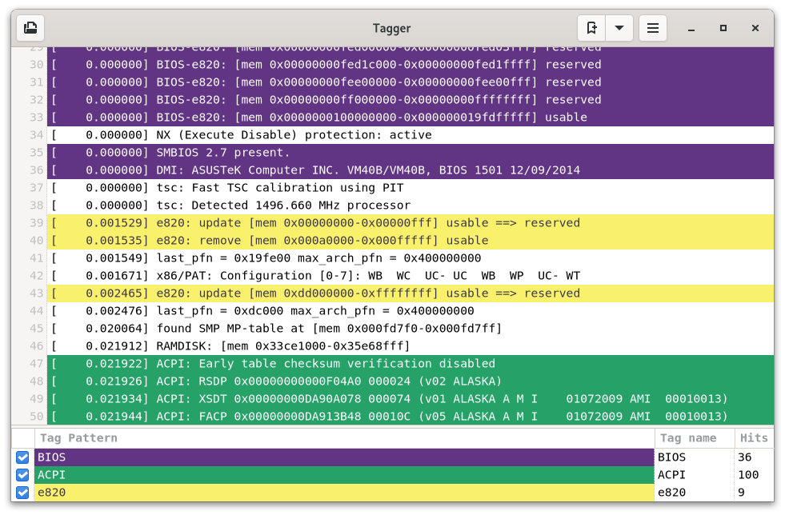

# Tagger

A GNOME text tagger inpired by the [TextAnalysisTool.NET](https://textanalysistool.github.io/)
tool.

The main goal is to aid log analysis by tagging lines with user defined colors.
Tags can have names, visibility toggle and hit count.

## Screenshot

## Features and Shortchuts

<kbd>Ctrl</kbd> + <kbd>N</kbd> : Add a Tag

<kbd>Ctrl</kbd> + <kbd>H</kbd> : Toggle untagged lines visibility

<kbd>Ctrl</kbd> + <kbd>F</kbd> : Hide/Show Tag list (bottom)

## Development

Developed with Vala + Gtk4.

### Dependencies

It depends on:

- meson
- ninja
- valac
- Gtk 4

### Build

Clone the repository and inside it, compile with:

`$ meson build && cd build && ninja`

Then, test it with:

`$ ./src/gtat`

If you want to install, do it with:

`$ ninja install`

---

Only works with text files and uses string matching rules.

