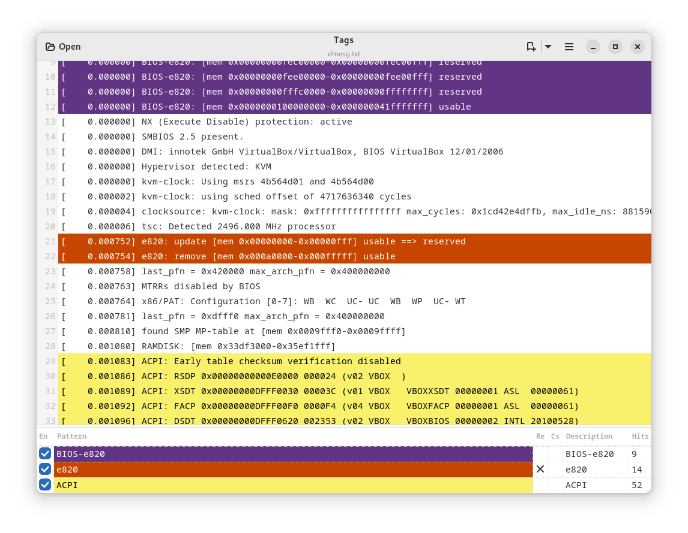

# Tags

A GNOME text tagger inspired by the [TextAnalysisTool.NET](https://textanalysistool.github.io/)
tool.

The main goal is to aid log analysis by tagging lines with user defined colors.
Tags have a description name, a visibility toggle, a color scheme and a hit counter.

## Screenshot

## Download

## Actions and Shortchuts

<kbd>Ctrl</kbd> + <kbd>N</kbd> : Add a Tag

<kbd>Ctrl</kbd> + <kbd>S</kbd> : Save tagged lines

<kbd>Ctrl</kbd> + <kbd>C</kbd> : Copy selected text lines to clipboard

<kbd>Ctrl</kbd> + <kbd>H</kbd> : Toggle untagged lines visibility

<kbd>Ctrl</kbd> + <kbd>F</kbd> : Hide/Show Tag list (bottom)

### Tags

Toggle the first ten tags with keyboard shortcuts.

<kbd>Alt</kbd> + <kbd>1</kbd> : Toggle enabled status for first tag

<kbd>Alt</kbd> + <kbd>2</kbd> : Toggle enabled status for second tag

...

<kbd>Alt</kbd> + <kbd>9</kbd> : Toggle enabled status for ninth tag

<kbd>Alt</kbd> + <kbd>0</kbd> : Toggle enabled status for tenth tag

---
#### Notice

**Using <kbd>Ctrl</kbd> instead of <kbd>Alt</kbd> will enable the respective tag
and hide all the others**.

---

### Additional features:

- Load tags
- Save tags
- Remove all tags
- Open new window
- User defined line numbering color scheme
- Simple tags based on a string containg a pattern
- Support for regular expressions
- Case sensitive support
- Automatic load tags file when opening a file and a similarly named file with
  added `.tags` extension exists

## Development

Developed with Vala + Gtk4.

### Dependencies

It depends on:

- meson
- ninja
- valac
- Gtk 4
- LibAdwaita-1
- json-glib-1.0

### Build

Clone the repository and inside it, compile with:

`$ meson build && cd build && ninja`

Install with:

`$ ninja install`

Then, test it with:

`$ tags`

---

Only works with text files and uses string matching rules.

