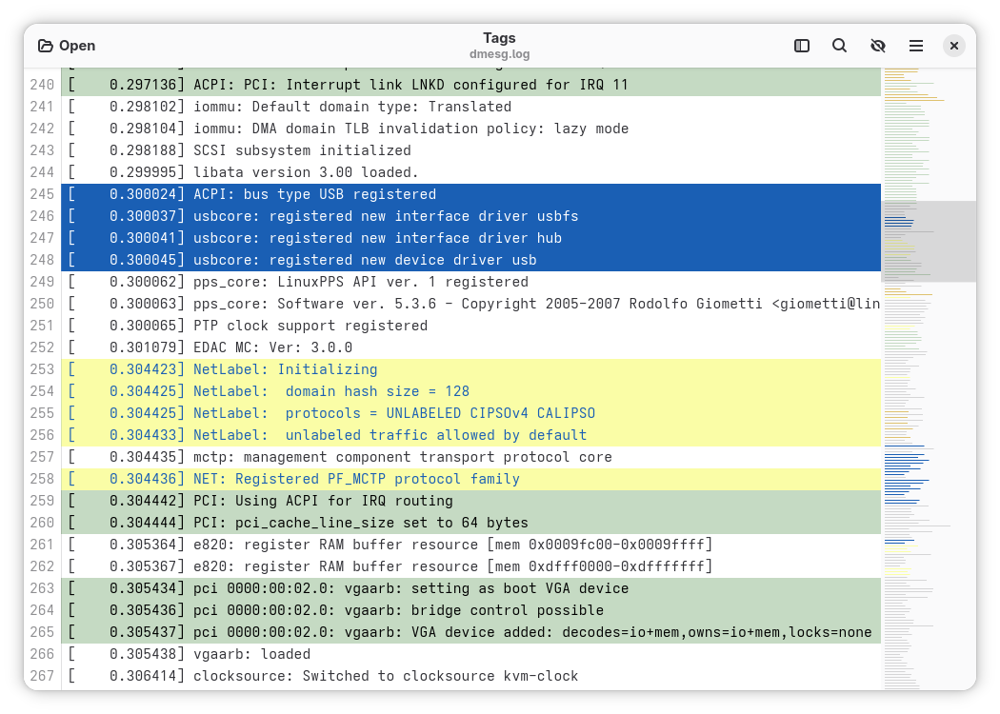

<div align="center">
  <span align="center"> </span>
  <h1 align="center">Tags</h1>
  <h3 align="center">Add color to your logs</h3>
</div>



A GNOME text tagger inspired by the [TextAnalysisTool.NET](https://textanalysistool.github.io/) tool.

The main goal is to aid log analysis by tagging lines with user defined colors. Tags have a match pattern, description name, visibility toggle, color scheme and hit counter.

---

## Download

<a href="https://flathub.org/apps/io.github.phastmike.tags">
  
</a>

---

## Additional Features

- Load tags
- Save tags
- Remove all tags
- Tag color scheme
- Hide untagged lines
- Search within visible lines (selection)
- Tags based on string comparison
- Support for regular expressions
- Case sensitive support
- Automatic load tags file (same filename + `.tags`extension)
- Navigate through hits with F2 and F3
- Minimap with tag colors and document navigation
- Experimental Line wrap support

---

## Actions and Shortcuts

### General Actions
| Shortcut | Action |
|----------|--------|
| `Ctrl` + `A` | Add a Tag |
| `Ctrl` + `S` | Save tagged lines |
| `Ctrl` + `C` | Copy selected text lines to clipboard |
| `Ctrl` + `F` | Search visible lines for given text |
| `Ctrl` + `H` | Toggle untagged lines visibility |
| `Ctrl` + `L` | Hide/Show Line numbers |
| `Ctrl` + `M` | Hide/Show Minimap |
| `Ctrl` + `I` | Show File information |
| `Alt` + `E` | Enable all tags |
| `Alt` + `D` | Disable all tags |
| `F9` | Hide/Show Tag list (sidebar) |
| `Ctrl` + `W` | Toggle line wrap |
| `Ctrl` + `+` | Increase number of lines per row (line wrap) |
| `Ctrl` + `-` | Decrease number of lines per row (line wrap) |

### Tags Toggle
Toggle the first ten tags with keyboard shortcuts:

| Shortcut | Action |
|----------|--------|
| `Alt` + `1` | Toggle enabled status for first tag |
| `Alt` + `2` | Toggle enabled status for second tag |
| ... | ... |
| `Alt` + `9` | Toggle enabled status for ninth tag |
| `Alt` + `0` | Toggle enabled status for tenth tag |

> **Note:** Using `Ctrl` instead of `Alt` will enable the respective tag and hide all the others.

### Navigation
*Requires a tag to be selected on the tag list*

| Shortcut | Action |
|----------|--------|
| `F2` | Previous tag hit |
| `F3` | Next tag hit |

Check the available shortcuts in the application menu with `Ctrl` + `?`.

---

## Development

Vala with Gtk4

### Dependencies

- meson
- ninja
- valac
- Gtk 4
- Libgee
- LibAdwaita-1
- json-glib-1.0

### Build

Clone the repository and inside it, compile with:
```bash
$ meson build && cd build && ninja
```

Install with:
```bash
$ ninja install
```

Then, test it with:
```bash
$ tags
```

---

## Additional Notes

Filters have a top down priority. Only works with text files and uses string matching rules or regular expressions.
