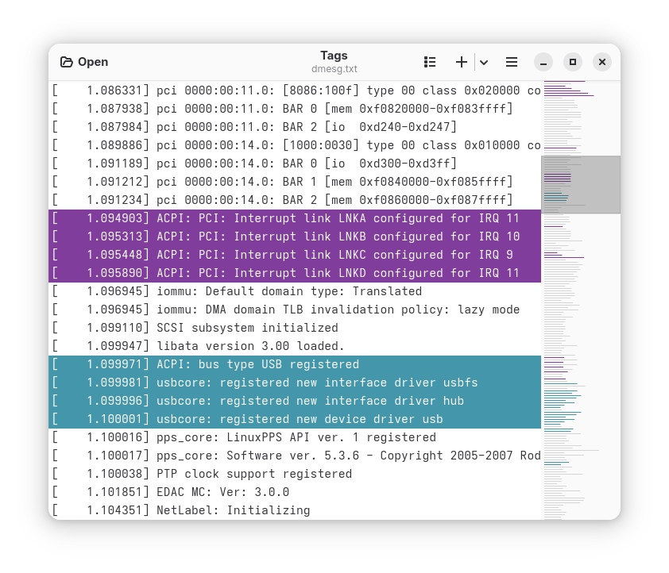

   
  <h1 align="center">Tags</h1>
  <h3 align="center">Add color to your logs</h3>

A GNOME text tagger inspired by the [TextAnalysisTool.NET](https://textanalysistool.github.io/)
tool.

The main goal is to aid log analysis by tagging lines with user defined colors.
Tags have a match pattern, description name, visibility toggle, color scheme and hit counter.

## Download

## Actions and Shortchuts

<kbd>Ctrl</kbd> + <kbd>A</kbd> : Add a Tag

<kbd>Ctrl</kbd> + <kbd>S</kbd> : Save tagged lines

<kbd>Ctrl</kbd> + <kbd>C</kbd> : Copy selected text lines to clipboard

<kbd>Ctrl</kbd> + <kbd>H</kbd> : Toggle untagged lines visibility

<kbd>F9</kbd> : Hide/Show Tag list (sidebar)

<kbd>Ctrl</kbd> + <kbd>L</kbd> : Hide/Show Line numbers

<kbd>Ctrl</kbd> + <kbd>M</kbd> : Hide/Show Minimap

<kbd>Alt</kbd> + <kbd>E</kbd> : Enable all tags

<kbd>Alt</kbd> + <kbd>D</kbd> : Disable all tags

### Tags

Toggle the first ten tags with keyboard shortcuts.

<kbd>Alt</kbd> + <kbd>1</kbd> : Toggle enabled status for first tag

<kbd>Alt</kbd> + <kbd>2</kbd> : Toggle enabled status for second tag

...

<kbd>Alt</kbd> + <kbd>9</kbd> : Toggle enabled status for ninth tag

<kbd>Alt</kbd> + <kbd>0</kbd> : Toggle enabled status for tenth tag

### Navigation

-- *requires a tag to be selected on the tag list*

<kbd>F2</kbd> : Previous tag hit

<kbd>F3</kbd> : Next tag hit

<kbd>Ctrl</kbd> + <kbd>M</kbd> : Toggle minimap visibility

---
#### Notice

**Using <kbd>Ctrl</kbd> instead of <kbd>Alt</kbd> will enable the respective tag
and hide all the others**.

- Check the available shortcuts in the application menu (<kbd>Ctrl</kbd> + <kbd>?</kbd>).

---

### Additional features:

- Load tags
- Save tags
- Remove all tags
- Open new window
- User defined line numbering color scheme
- Simple tags based on a string containg a pattern
- Support for regular expressions
- Case sensitive support
- Automatic load tags file when opening a file and a similarly named file with
  added `.tags` extension exists
- Navigate thru hits with F2 and F3
- Random color scheme on tag creation
- Document minimap with tag colors (bg-color)

## Development

Developed in Vala + Gtk 4

### Dependencies

It depends on:

- meson
- ninja
- valac
- Gtk 4
- Libgee
- LibAdwaita-1
- json-glib-1.0

### Build

Clone the repository and inside it, compile with:

`$ meson build && cd build && ninja`

Install with:

`$ ninja install`

Then, test it with:

`$ tags`

---

Filters have a top down priority.
Only works with text files and uses string matching rules or regular expressions.

